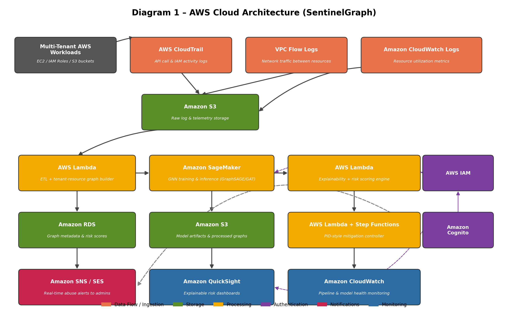
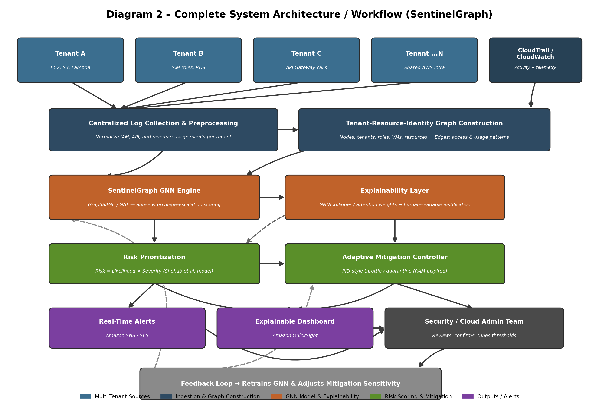

# Cloud Resource Abuse Detection in Multi-Tenant Environments

This is the project repository for BCSE355L - Cloud Architecture Design (2026).

Our project is called **SentinelGraph** - a system that detects and mitigates cloud resource abuse in multi-tenant AWS environments using graph-based machine learning with explainability.

## Team

| Name | Branch |
|------|--------|
| Nishit Jain | feature/student1 |
| Arvind Sundaram | feature/student2 |
| D.Ebenezer Paul Leon | feature/student3 |

Course Instructor: Dr. Priya V

---

## What the project does

Multi-tenant cloud environments have a problem where one tenant can abuse shared resources (excessive CPU, DDoS, privilege escalation etc.) and affect other tenants. Existing solutions mostly use threshold-based detection which misses complex abuse patterns.

We are building SentinelGraph which models tenant activity as a graph (tenants, resources, IAM roles as nodes, usage patterns as edges) and uses a Graph Neural Network to detect abuse. The key feature is that it also explains *why* something was flagged, not just that it was.

## Objectives

1. Build a cloud monitoring system to detect resource abuse in multi-tenant AWS
2. Use an explainable GNN model (GraphSAGE/GAT) to detect and explain anomalies
3. Reduce response time using Lambda and Step Functions instead of manual intervention
4. Store tenant activity data securely in S3 and RDS
5. Send real-time alerts and show explainable dashboards via QuickSight
6. Handle authentication with IAM and Cognito

## Novelty

Most existing work either:
- Uses threshold-based methods that miss structural abuse (quota staying methods)
- Uses classical ML (like LightGBM) that can't model relational/graph data
- Doesn't explain why something is flagged

SentinelGraph addresses this by:
- Combining network-level (CSE-CIC-IDS2018) and identity-level (CERT) data in one unified graph
- Using GNNExplainer/attention weights to give human-readable justification per alert
- Automating mitigation using a PID-style controller based on `Risk = Likelihood x Severity`
- Running inference on a serverless SageMaker endpoint so it scales with tenant count

## Architecture

### AWS Cloud Architecture



Shows how data flows from multi-tenant workloads through CloudTrail, VPC Flow Logs and CloudWatch into S3, then gets processed by Lambda, trained/served by SageMaker, scored by the explainability engine, and finally surfaced through QuickSight dashboards and SNS alerts.

### System Architecture / Workflow



Shows the end-to-end workflow: tenant activity gets collected and turned into a Tenant-Resource-Identity graph, scored by the GNN, risk-prioritized, and then handled by the adaptive mitigation controller. There's a feedback loop that retrains the model and adjusts mitigation sensitivity over time.

---

## Datasets

We use two datasets because no single dataset has both network-level abuse and identity/access signals together.

### Dataset 1 - CSE-CIC-IDS2018

| | |
|---|---|
| Source | Canadian Institute for Cybersecurity (hosted on AWS) |
| URL | https://www.unb.ca/cic/datasets/ids-2018.html |
| Size | ~450 GB raw, ~16.23 million labeled flow records |
| Features | 80 per-flow features (CICFlowMeter-V3) |
| Labels | 15 classes (14 attack types + benign), we use binary abuse/non-abuse |
| License | Free for research, attribution required |

This gives us the resource-abuse side - DoS, DDoS, botnet, brute force, infiltration patterns that map onto the tenant-resource edges of the graph.

Preprocessing needed:
- Merge 10 daily CSV files
- Remove constant/near-duplicate columns
- Normalize features
- Map IP-port pairs to synthetic tenant/resource node IDs

### Dataset 2 - CERT Insider Threat Dataset r4.2

| | |
|---|---|
| Source | Carnegie Mellon University CERT Division |
| URL | https://kilthub.cmu.edu/articles/dataset/Insider_Threat_Test_Dataset/12841247 |
| Size | ~1000 simulated users, ~32.8 million event records over 17 months |
| Features | 4-10 fields per log type (logon, file, email, device, http, psychometric) |
| Labels | 70 malicious users, rest normal (~1:14 imbalance) |
| License | Research-use license via CMU CERT request |

This gives us the identity/privilege-escalation side - user-role-resource relationships from LDAP become nodes and edges for detecting lateral movement.

Preprocessing needed:
- Join 6 log files on user ID and timestamp
- Aggregate into session-level vectors per user
- Build identity graph from LDAP structure file
- Align malicious-user answer files for ground-truth labels
- Handle class imbalance

---

## AWS Services

| Service | What we use it for |
|---------|-------------------|
| Amazon EC2 | Tenant simulation testbed and web dashboard |
| Amazon S3 | Raw logs, processed graphs, trained model artifacts |
| AWS CloudTrail | IAM and API activity logs - feeds identity edges in graph |
| Amazon VPC Flow Logs | Network traffic between tenant resources - feeds resource-abuse edges |
| Amazon CloudWatch | Resource utilization metrics and pipeline health monitoring |
| AWS Lambda | ETL, graph construction, explainability/risk scoring, pipeline glue |
| Amazon SageMaker | Train and serve the GNN model (GraphSAGE/GAT) |
| AWS Step Functions | Orchestrate the mitigation workflow (detect → prioritize → throttle/quarantine) |
| Amazon RDS | Graph metadata, per-tenant risk scores, scoring history |
| AWS IAM | Least-privilege access control across all services |
| Amazon Cognito | Dashboard authentication for cloud admins |
| Amazon SNS / SES | Real-time abuse alerts to security team |
| Amazon QuickSight | Explainable risk dashboards with attention-weight justifications |

---

## Folder Structure

```
Cloud_Resource_Abuse_Detection_Cloud_Project_2026/
├── README.md
├── LICENSE
├── .gitignore
├── docs/
│   ├── Project_Report.docx
│   ├── Literature_Survey.docx
│   ├── Research_Gap.docx
│   ├── Objectives.docx
│   ├── Novelty.docx
│   ├── Research_Gap_Student1_NishitJain.md
│   ├── Research_Gap_Student2_ArvindSundaram.md
│   └── Research_Gap_Student3_EbenezerPaulLeon.md
├── architecture/
│   ├── AWS_Architecture.png
│   ├── System_Architecture.png
│   └── Workflow.png
├── dataset/
│   ├── raw/
│   ├── processed/
│   └── Dataset_Details.md
├── src/
│   ├── frontend/
│   ├── backend/
│   ├── ml_model/
│   │   ├── preprocessing.py
│   │   ├── train.py
│   │   └── predict.py
│   └── aws/
│       ├── lambda/
│       ├── s3/
│       ├── ec2/
│       ├── iam/
│       └── cloudwatch/
├── results/
│   ├── graphs/
│   └── screenshots/
└── presentation/
```

## Branch Strategy

```
main
 |
 └── develop
      |
      ├── feature/student1  (Nishit Jain - frontend + architecture)
      ├── feature/student2  (Arvind Sundaram - backend + AWS)
      └── feature/student3  (D.Ebenezer Paul Leon - dataset + ML model)
```

Each student works only on their own feature branch and raises PRs to develop. Once stable, develop gets merged into main.

## Contribution

| Task | Nishit Jain | Arvind Sundaram | D.Ebenezer Paul Leon |
|------|:-----------:|:---------------:|:--------------------:|
| Literature Survey | yes | yes | yes |
| Research Gap Analysis | yes | yes | yes |
| Frontend | yes | | |
| Backend | | yes | |
| Database | | yes | |
| AWS Services | | yes | |
| ML Model | | | yes |
| Dataset | | | yes |
| Testing | yes | yes | yes |
| Documentation | yes | yes | yes |
| Presentation | yes | yes | yes |
